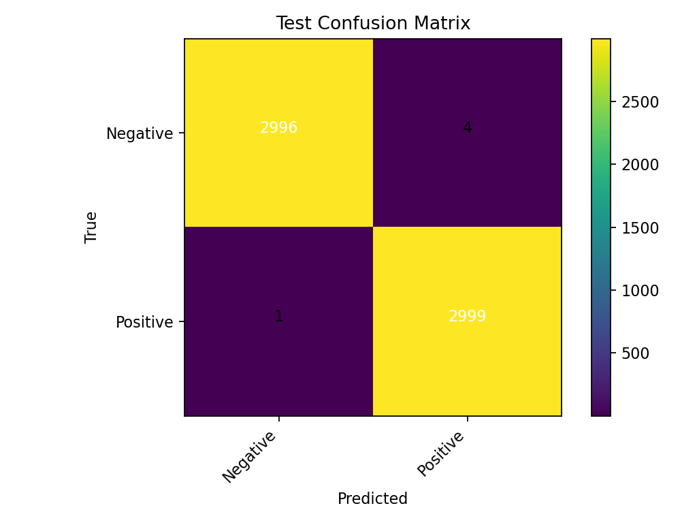
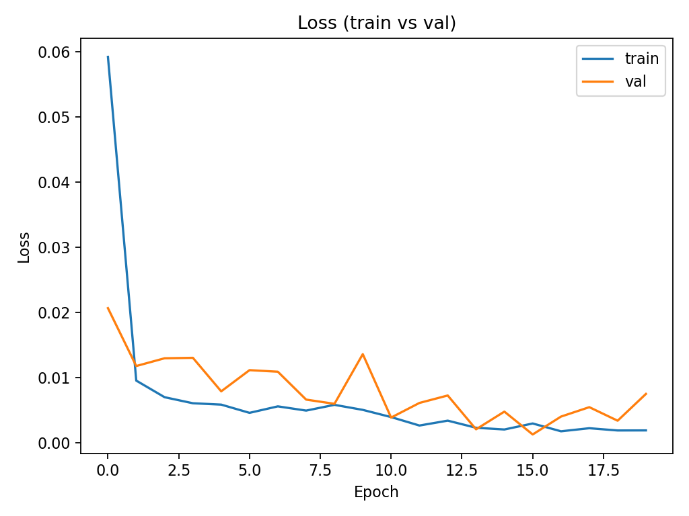

# Concrete Image Classification with CNN

A deep learning project using Convolutional Neural Networks to classify concrete images into positive/negative categories, achieving **99.92% test accuracy**.

## 🎯 Project Overview

This project implements a CNN-based binary classifier for concrete image analysis using Keras and TensorFlow with transfer learning. The model was trained on high-performance computing (HPC) infrastructure to efficiently process large-scale image datasets.

## 📊 Results

- **Test Accuracy:** 99.92%
- **Test Loss:** 0.0030
- **Model Architecture:** MobileNetV2 with transfer learning

### Confusion Matrix



|                     | Predicted Negative | Predicted Positive |
| ------------------- | ------------------ | ------------------ |
| **Actual Negative** | 2996               | 4                  |
| **Actual Positive** | 1                  | 2999               |

### Training Performance



## 🛠️ Tech Stack

- **Deep Learning:** Keras, TensorFlow
- **Data Processing:** NumPy, Pandas
- **Visualization:** Matplotlib, Seaborn
- **Infrastructure:** HPC cluster computing
- **Environment:** Terminal-based workflow

## 📁 Project Structure

```
concrete-classification/
├── README.md
├── requirements.txt
├── notebooks/
│   └── concrete_analysis.ipynb       # Complete analysis notebook
├── models/
│   └── concrete_cnn_model.keras      # Trained model
├── results/
│   ├── confusion_matrix.png
│   ├── loss_curves.png
│   └── metrics.txt
├── splits/
│   └── .gitkeep                      # Train/val/test splits
└── data/
    └── README.md                     # Dataset information
```

## 🚀 Getting Started

### Prerequisites
```bash
python >= 3.8
tensorflow >= 2.10
keras >= 2.10
```

### Installation
```bash
git clone https://github.com/yourusername/concrete-classification.git
cd concrete-classification
pip install -r requirements.txt
```

### Training the Model
```bash
python src/train.py
```

### Loading Pre-trained Model
```python
from keras.models import load_model

model = load_model('models/concrete_cnn_model.keras')
# Make predictions on new images
predictions = model.predict(your_data)
```

## 📈 Model Architecture

**Transfer Learning Approach:**
- Base model: MobileNetV2 (pre-trained on ImageNet)
- Data augmentation: Random flips, rotations, zoom, and contrast
- Global Average Pooling layer
- Dropout (0.25) for regularization
- Dense output layer with softmax activation

**Two-stage Training:**
1. Stage 1: Train with frozen MobileNetV2 base (6 epochs)
2. Stage 2: Fine-tune top 40 layers (6 epochs)

## 📊 Dataset

This project uses the public **Concrete Dataset** for binary image classification.

**Dataset characteristics:**
- Total samples: 40,000 images (20,000 per class)
- Source: 458 high-resolution images (4032×3024) augmented
- Image size: 227×227 pixels, RGB channels
- Classes: Negative (no defect), Positive (defect present)
- Split: 70% train, 15% validation, 15% test

Dataset download instructions can be found in `data/README.md`.

## 💡 Key Learnings

- Implemented transfer learning with MobileNetV2 architecture
- Applied two-stage training: frozen base followed by fine-tuning
- Gained experience with HPC cluster computing and terminal-based workflows
- Implemented data preprocessing and augmentation techniques
- Conducted thorough model evaluation with confusion matrices and loss curves

## 📝 Future Improvements

- Experiment with other architectures (EfficientNet, ResNet)
- Implement additional data augmentation techniques
- Deploy model as REST API for real-time inference
- Extend to multi-class classification for different defect types

## 📄 License

This project is licensed under the MIT License.
